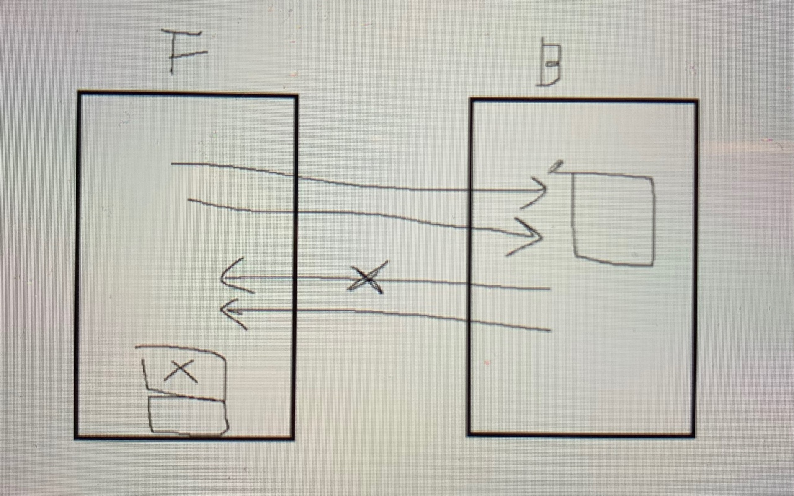

# React NodeBird SNS

## 네가지 주체
* Browser
* Frontend
* Backend
* Database

## React 페이지와 Next 페이지의 구분
* 사용자가 빠르게 interaction이 필요할 때 react를 사용
    * 단점 : loading 창 밖에 없을 경우 미완성인 상태로 오인되기도 함 (국내 검색엔진)
    * 단점을 보완 
        * code splitting : 방문한 페이지의 코드만 가지고 오는 방법
        * serverside rendering : 첫 방문만 전통적 방법으로 하고 후에 리액트 방식 적용
            * 첫 방문에는 브라우저 - 프론트 - 백 - 데이터베이스 
            * 그 다음 방문 부터는 브라우저 - 백
        * prerender : 검색엔진일 때만 html을 완성해서 주고, 일반 유저는 loading 창 (기존 리액트 방식)
        * ⭐️serverside rendering 과 code Splitting은 실무에서 꼭 적용해야 함
* Next.js 가 필요 없는 페이지 (React) : admin 페이지
* React 로 serverside rendering : #reactGo
* 기존방식 : CSR 
    * CSR 은 프론트서버에서 다시 브라우저로 돌아오는데 모든 사이트를 다 담아서 돌아옴
    * 받아온 후에는 백엔드를 통해서 데이터만 받아옴
* 검색엔진 -> 서버사이드 렌더링 필요 , 그렇지 않다면 리엑트만
* 리액트 -> 고객경험 중시한다면 리액트 그렇지 않아도 된다면 html, css
* 관계 중심 -> sql / 로그 쌓일 때 , 관계가 없을 때 -> mongodb

## 중앙저장소 역할 
* React Context API
    * 요청, 성공, 실패를 모두 구현해주어야 함
    * `useEffect()` axios
* Redux
    * 장점: 원리가 간단해서 에러 확률이 적음 / 단점 : 코드량이 많음
* MobX
    * 장점 : 코드가 간단함 / 단점 : 에러추적이 어려움
* graphQL 아폴로

## 비동기 STEP
1. 요청
2. 성공 
3. 실패

## install 
**front**
* `npm init`
* `npm i next` or `npm i next@9`
* `npm i react react-dom`
* `npm i prop-types`
* `npm i eslint -D`
* `npm i eslint-plugin-import -D`
* `npm i eslint-plugin-react -D`
* `npm i eslint-plugin-react-hooks -D`
* `npm i antd styled-components @ant-design/icons`
* `npm i redux`
* `npm i next-redux-wrapper` err `--legacy-peer-deps`
* `npm i react-redux`
* `npm install redux-devtools-extension`
* `npm i react-slick`
* `npm i redux-saga`
* `npm i next-redux-saga`
* `npm i axios`
* `npm i -D babel-eslint eslint-config-airbnb eslint-plugin-import`
* `npm i -D eslint-plugin-react-hooks`
* `npm i -D eslint-plugin-jsx-a11y`
* `npm i shortid`
* `npm i immer`
* `npm i faker`
---
**back**
* `npm i express`
* `npm i sequelize sequelize-cli`
* `npm i mysql2`

## step 
1. `npm init`
2. `npm i next` or `npm i next@9`
3. `package.json` `"test": "echo \"Error: no test specified\" && exit 1"` -> `"dev": "next"`
4. `pages` 폴더 만들기 : 이름이 꼭 **pages** 여야 한다. next는 pages를 인식
    * `pages` 안에서 폴더 생성 가능
5. `npm run dev`
6. err -> `npm i react react-dom`
7. `npm i prop-types`

## Next
* `package.json` `"test": "echo \"Error: no test specified\" && exit 1"` -> `"dev": "next"`
* `pages` 폴더 만들기 : 이름이 꼭 **pages** 여야 한다. next는 pages를 인식
* `Link` `import Link from 'next/link';`
* **Live server** 의 기능 react 의 `hot loader` 기능도 next는 가지고 있음
* 공통파일 처리는 `_app.js` 파일 내 
* `<head></head>` 를 커스텀 하고 싶을 땐 `import Head from 'next/head'`

## eslint
* `npm i eslint -D`
* `npm i eslint-plugin-import -D`
* `npm i eslint-plugin-react -D`
* `npm i eslint-plugin-react-hooks -D`
* `package.json` 에서 확인 가능
* `.eslintrc` 파일 생성
    * 맥에서는 숨김기능 / 확장자는 없음

## style
* `antd` `styled-components` `npm i antd styled-components @ant-design/icons`
* `antd` 연결은 Next.js 의 공통파일에 적용되는 `_app.js`에 css 적용 (참고 _ antDesign 홈페이지 doc)

### 인라인 스타일 주의점
* `<div style={{ marginTop: '10' }}>`
* 리렌더링 될 때마다 객체가 새로 생기며 불변성의 원칙으로 {}==={} false 의 결과 를 초래
* styled-components를 사용해서 스타일을 입혀야함

## 리렌더링
* 함수 안에 있는 부분이 처음부터 끝까지 다시 실행
* `useCallback` , `useMemo` 배열이 바뀌지 않는 이상 같은걸로 침 -> 바뀐것이 없는 것으로 처리
* retrun 이 virtual Dom
* 리턴 부분중 달라진 부분을 다시 그림
* 리렌더링 될 때마다 객체가 새로 생기며 불변성의 원칙으로 {}==={} false 의 결과 를 초래

## useCallback 과 useMemo 
* 최적화 시켜주기 위해서는 함수 사용시 `useCallback` 항상 사용
* `useCallback` 은 함수를 캐싱, `useMemo` 는 값을 캐싱
* style `useMemo` 사용 예_ `const style = useMemo(()=>({marginTop: 10}), [])`

## git 
* `rm .git/index.lock` 

## npm
* [npm trend 사이트](https://www.npmtrends.com/)

---

## Redux
* next Redux wrapper
* front > store 폴더 생성 > configureStore.js 파일 생성
* `npm i redux`
* `npm i next-redux-wrapper --legacy-peer-deps`
* store > app.js 설정 (redux 처럼 provider를 감싸주진 않는다)
* front > reducers 폴더 생성 > index.js 파일 생성
    * intialState
    * action
    * reducer
* `npm i react-redux`
* react-redux 의 `useSelector` (부모) 참고_ AppLayout.js
* react-redux 의 `useDispatch` (자식 - 하위컴포넌트) 참고_ UserProfile.js
* `npm install redux-devtools-extension`
* store > configureStore.js

### Redux 파일 쪼개기 
* initialState 에 따라 user.js / post.js 파일 생성
* 파일 모두 reducer 세팅 그대로
* index.js 파일에서 reducerCombine을 사용해서 합쳐준 후
* 기존 dispatch 한 부분 경로 변경해주기

### 씨콜라이즈
* reducers > post.js
* 다른 정보들과 합쳐주는 naming은 첫글자가 대문자

### 아이디를 index로 쓰지 않는 방법..
* 배열에 아이디를 만든다..

## [object object] 가 뜨고 있다는것 .. ?
* 글자 문자열이 객체로 변환되고 있다는것

## 정규식 사용하기
[정규식 regex](https://regexr.com/)
* `g` (전부일 때 붙임)
* `#.` #뒤에 .은 한글자 / +는 전부
* `[]` 는 공백제거 / 본래뜻 [] 대괄호 안에 있는것들만 선택 `[^]` 제외의 의미를 둘 수 있음
* `\s` 는 공백제거
* `#` 같이 끊어줌
* `split()`을 사용할 때 `()`괄호로 감싸주는것이 포함관계와 관련이 있음

## Middleware Saga, Thunk
* 리덕스에 없는 기능을 구현해줌
* dispatch를 한번에 하고 비동기.. 지연시켜줌

### Thunk
* dispatch를 한번에 할수있게 도와줌

### Saga
* delay 기능 포함 / 미리 만들어서 제공
* 클릭 두번 돌아갈때 thunk는 두번 요청이 가지만 Saga는 `takelatest` 첫번째것 무시
* 스크롤 이벤트는 여러개가 한번에 가기때문에 비동기중에 스크롤이 발생하면 쓰로틀 (1초에 몇번까지만 허용해줌)
* `delay` `throttle` `debounce`
### saga start
* generatore `function*` : 특별한 역활을 하는 함수
    * `yield` 한번 하고 멈추고 또 실행하면 그 담음 것을 실행하고 멈춤
    * generatore 은 중간점이 있는 함수 -> `done: false` / `done: true` done이 true가 될때까지
    * 절대 멈추지 않는 generator
```
//yield
const gen = fuction* (){
    console.log(1); // gen() 1
    yield;
    console.log(2);// gen() 2
    yield;
    console.log(3);// gen() 3
    yield 4;// gen() value:4
}

const generator = gen();

generator.next(); //1
generator.next(); //2
```
```
// 절대멈추지 않는 generator , 중단점 하나 넣어두고 계속 불러주면 다음 코드가 실햄됨
// 이벤트리쓰너로도 이용할 수 있음
let i = 0;
const gen = function*(){
    while(true) {
        yield i++;
    }
}
```
* sagaEffect
    * effect 앞에는 yield를 붙혀줌
    * `fork` 비동기 함수를 실행하는 것 - 바로 다음 것을 실행해버림 / `call` 동기 함수를 호출하는것 - 기다렸다가 실행함
    * yield는 await와 비슷한 역할을 하고 fork는 await를 쓰지 않은 효과
    * `all` 동시에 실행될 수 있게 해줌
    ```
    function* watchLogin() {
        yield take('LOG_IN', logIn);
    };
    // LOG_IN action이 실행되면 logIn 함수를 실행
    ```
    * `take` 함수를 실행할때까지 기다림
        * 일회용이기 때문에 무한인 `while(true){} = takeEvery` 를 사용
        * but, 실수로 두번 클릭하는 것을 방지하기 위해 `takeLatest` 사용 -> 동시에 로딩중인것만 취소처리 (front에서만 인식하는것)
        * takeLatest는 응답만 취소하는 것이기 때문에 요청이 두번 가는 것은 서버에서 연달아 오는 요청은 하나 지워야하는 코드가 있어야함
        * 
        * `throttle`은 2초에 딱 한번만 함수를 실행할수 있게 하는것 요청보내는것까지 조절
        * 보통 스크롤 이벤트에 `throttle` 을 많이 사용하고 `debounce` 는 검색결과 보낼때 많이 사용
    * `delay` `debounce` `takeLatest` `throttle` `takeEvery` `takeMaybe` `takeReading`

    ## 데이터 흐름
    로그인Form -> 로그인 / loginRequestAction -> saga LOG_IN_REQUEST 과 리듀서 LOG_IN_REQUEST 동시에 실행 -> saga에서 데이터를  LOG_IN_SUCCESS 로 액션 바뀜 -> reducer 에서 isLoggingIn, isLoggedIn 상태가 바뀜

    `PostForm.js` -> `addPost(text)` -> 리듀서 `addPost(data)` -> 사가 `data: action.data` -> 리듀서 

    ## 더미 데이터를 만들때 사용하면 유용한 것들
    * shortid
    * faker

## 불변성 유지 ..
```
const postIndex = state.mainPosts.findIndex((v)=> v.id === action.data.postId);
const post = {...state.mainPosts[postIndex]};
post.Comments = [dummyComment(action.data.content), ...post.Comments];
const mainPosts = [...state.mainPosts];
mainPosts[postIndex] = post;
```

## immer 사용법
* 리덕스뿐 아니라 리액트에서도 사용 가능
* 훅버전은 `use-immer`
```
import produce from 'immer';

return produce(state, (draft)=>{

})
```
* 추가해서 사용할 때에는 `unshift` 사용

## 추천 
* faker
* Redux toolkit 
    * code 사용을 줄여준다 ex. switch문 사용하지 않아도 됨
    * immer와 같이 사용하기에는 애매
* placeholder.com 
* lorempixel.com
* React virtualized
    * 메모리 특히, 모바일의 경우 무한 스크롤 할때 나타날 수 있는 문제를 해결
    * 인스타에서 사용 화면에 보이는 것만 유지 그리고 나머지는 메모리에만 있음
    * 화면에 3-4개만 화면에 그려주고 나머지는 메모리에 담고있는
* swagger
    * restAPI 타협을 위한 문서화 툴

## 서버
**front가 요청을 보내면 back이 응답을 해줌**
**요청을 받으면 무조건 응답해야해고 그렇지 않으면 30초후 자동 실패 메시지게 뜸**
**요청과 응답은 1:1 matching 응답을 두번 보내서는 안됨, res.end는 한번만 사용**

1. back 폴더에서 `npm init` 으로 `package.json` 생성 (package name 과 author만 설정)
    * font 와 back을 나누는 이유? front의 요청이 1000개로 부족하여 컴퓨터 두대를 나누어 요청을 받는 경우 front 와 back이 같이 있으면 컴퓨터를 늘릴때도 필요없는 back까지 복사해야함
2. `app.js` 파일에 다음과 같은 코드 생성 `node app.js` 로 코드실행
```
const http = require('http');

const server = http.createServer((req, res)=>{
  console.log(req.url, req.method);
  res.end('Hello Node!')
});

server.listen(3065, () => {
  console.log('서버실행중')
});
// http.listen(3000);
```
3. `package.json` 에 `"dev": "",` script 정보 추가

4. 기본 `node` 작성 방식, 복잡해지기때문에 `express` 사용
```
// 기본 node
  if(req.method === 'GET') {
    if(req.url === '/api/posts') {

    }
  } else if(req.method === 'POST') {
    if(req.url === '/api/posts') {

    }
  } else if(req.method === 'DELETE') {
    if(req.url === '/api/posts') {

    }
  }
```
`npm i express`
```
// express 사용
const express = require('express');

const app = express();

app.listen(3065, () => {
  console.log('서버실행중')
})

// 자주 사용

// get, post, put .. 정확히 지키는 것을 restAPI 라고함
// 시멘틱이랑 비슷한 의미
// ex. 게시글 가져오면서 조회수를 1 올린다 와 같이 애매한것들은 'post'를 이용

// app.get     -> 가져오기
// app.post    -> 생성하기
// app.put     -> 전체수정
// app.delete  -> 제거
// app.patch   -> 부분 수정 ex. 닉네임만 수정
// app.options -> 찔러보기 ex. 요청 보낼수 있어?
// app.head    -> 헤더만 가져오기
```

## MySQL
* 마리아 db, postgram, 오라클(이 프로젝트와 호환 x)
* community server, workbench 를 다운
    * [mysql download](https://downloads.mysql.com/archives/community/)
    * m1은 버전 8.0.22 와 호환 가능
* `npm i sequelize sequelize-cli mysql2`
    * sequelize 는 자바스크립트를 sql 언어로 바꿔주는 역할
    * mysql2 는 mysql과 코드를 연결해주는 드라이버
* `npx sequelize init`
    * sequelize setting
    * config, migrations, models 폴더 생김
    * config -> config.json
    * "password": "mysqlpassword", "database": "react-nodebird", "port": "3306",

* model 만들기 
    * 단수형 naming
    * `module.exports = (sequelize, DataTypes) => {}` 모델의 기본 꼴
    * model = mysql의 table
    * model은 앞에 대문자, 단수형 = MySQL 앞에 소문자, 복수형으로 저장 됨
    * 모델로 만든 것들은 서로 관계가 있음
    * 관계들은 `associate`에다 적는것
    * 기본적으로 낱개를 먼저 만들어두고 후에 관계 형성
    * column 정보 추가

